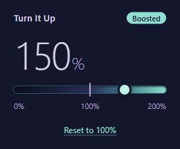

# Turn It Up: Tab Volume Booster

A small browser extension that makes one tab quieter or louder, from 0% up to 200%. Made for that one video that's too quiet even with everything turned up. Your computer's volume and your other tabs stay as they are.

## Install
Turn It Up isn't in a browser's add-on store, so you install it by hand. It takes about a minute.

**Before you install:** your browser will say this extension can "read and change all your data on all websites". That's its standard wording for the one permission the boost needs, to hear a tab's sound. Turn It Up uses it only for sound, only on a tab where you moved the slider, and has no code that connects to the internet. The whole extension is a few small files in the `extension` folder.

1. **Download** the `.zip` file from the [latest release](https://github.com/Akzh00/turn-it-up-volume-booster/releases/latest) (under **Assets**).
2. **Unzip it:** right-click the zip → **Extract All** → **Extract** (on a Mac, double-click it).
3. **Move the unzipped folder somewhere permanent**, such as your Documents folder. The browser runs the extension from it, so deleting it later removes the extension.
4. **Open your browser's extensions page** by typing `chrome://extensions` in the address bar (in Edge, `edge://extensions`; in Brave, Opera or Vivaldi, the browser's name then `://extensions`). Turn on **Developer mode**: the switch is at the top right, or on the left in Edge.
5. Click **Load unpacked**, choose the unzipped folder and click **Select Folder**. You'll only see an `icons` folder inside; that's normal.
6. Click the puzzle-piece icon in the toolbar and click the pin next to **Turn It Up**, so its speaker icon stays in the toolbar.

## How to use it
1. Go to the tab that's too quiet (or too loud) and click the **speaker icon**.
2. Drag the **slider**: left is quieter (0% is silent), right is louder (up to 200%). The line in the middle is normal volume, 100%.
3. The popup says **Boosted** above 100%, and the speaker icon shows the volume (for example **150**) on any tab that isn't at 100%.
4. **Reset to 100%** puts the tab back to normal volume.

The setting is for that one tab. It stays when the page reloads or you go to another site in the same tab, and ends when you close the tab. New tabs start at 100%.

## Good to know
- **"Sharing this tab" icon:** once you move the slider, the browser shows a small capture icon on that tab. That's how the extension gets the tab's sound to make it louder. It stays until you close the tab, even after Reset.
- **A tiny hiccup, once:** the first time you move the slider on a tab, the sound skips for about a tenth of a second. After that, moving the slider or pressing Reset is smooth.
- **No crackling:** above 100%, the loudest moments are gently turned down instead of distorting, so 200% sounds clean. Very loud videos just won't get much louder than they already are.
- **Some pages can't be changed:** the browser doesn't let extensions capture its own pages (settings, new tab, the add-on store). The popup then says "Can't change the volume on this page."
- **Privacy:** the extension collects no data. Each tab's volume is kept only in your browser and forgotten when the tab closes.

## Update or remove
- **Update:** Turn It Up doesn't update itself. When a new version is out, download its zip, remove the old Turn It Up on the extensions page, and load the new folder the same way.
- **Remove:** open the extensions page and click **Remove** under Turn It Up. You can then delete its folder.

## Version
1.0.0. Made by Akzh00. No third-party art, fonts or sounds.
